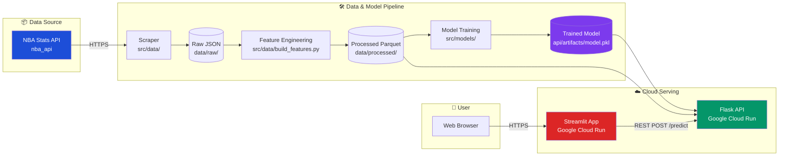

# NBA Playoff Underperformance Predictor

> **STAT 418 Final Project** — Hanzhang Yuan (Spring 2026)

A machine learning system that predicts whether an NBA player will underperform in a specific playoff game relative to their regular-season baseline, using historical box-score statistics from 2003–2025.

## 🔗 Deployed services

The application is deployed in **two places** for redundancy during the evaluation window. Both serve the same model and the same Cloud Run API.

| Service | Platform | URL |
|---|---|---|
| **Web App (primary)** | Google Cloud Run | https://nba-playoff-app-803317660037.us-central1.run.app |
| Web App (backup) | Streamlit Community Cloud | https://stat418-final-project-stnrtix9jwpgzt5m6cfhfy.streamlit.app |
| **Model API** | Google Cloud Run | https://nba-playoff-api-803317660037.us-central1.run.app |
| API docs (Swagger UI) | Google Cloud Run | https://nba-playoff-api-803317660037.us-central1.run.app/docs |

> **Note on app hosting.** The project rubric specifies that "the App should be hosted on shinyapps.io or Google Cloud Run." The Cloud Run App URL above satisfies that requirement. The Streamlit Community Cloud URL is kept as a secondary, redundant deployment of the same Streamlit code — it deploys automatically on every push to `main` and serves as a backup if Cloud Run has cold-start issues. Both point to the same Flask API on Cloud Run.

---

## Project Overview

### Research Question
> Can we predict, before a playoff game tips off, whether a given NBA player is likely to underperform his regular-season production in that specific game — and explain *why*?

### Problem Framing
- **Unit of analysis:** player-game (a single NBA player in a single playoff game)
- **Target variable:** binary — `1` if Game Score in that playoff game falls more than 1.0 below the player's regular-season average Game Score, else `0`
- **Performance metric:** [Hollinger Game Score](https://www.basketball-reference.com/about/glossary.html)
  ```
  GS = PTS + 0.4·FGM − 0.7·FGA − 0.4·(FTA−FTM) + 0.7·OREB + 0.3·DREB
       + STL + 0.7·AST + 0.7·BLK − 0.4·PF − TOV
  ```
- **Approach:** supervised binary classification using only information available **before** each playoff game starts

### Why This Matters
NBA front offices, analysts, and fans care deeply about whether regular-season stars will deliver in the playoffs. Defensive intensity tightens, rotations shrink, and opposing teams scout individual tendencies. Some stars rise to the occasion; others fade. This project quantifies that "fade risk" using only data available before tip-off.

---

## Solution Architecture



A high-resolution architecture diagram is available in [`docs/architecture_diagram.png`](docs/architecture_diagram.png).

---

## Repository Structure

```
stat418-final-project/
├── data/                  # Raw + processed datasets (raw not committed)
├── notebooks/             # EDA + training notebooks (4 numbered notebooks)
├── src/                   # Core Python package (data, models, utils)
├── api/                   # Flask API + Dockerfile + tests
├── app/                   # Streamlit App + Dockerfile
├── docs/                  # Architecture diagram, writeup, AI usage doc
├── presentations/         # Proposal & final PDFs
├── tests/                 # Top-level integration tests
└── .github/workflows/     # CI: tests, build, deploy
```

Each top-level directory contains its own `README.md` with details.

---

## How to Run Locally

### Prerequisites
- Python 3.10+
- Docker Desktop (optional, for containerized run)
- ~2 GB free disk space (for cached NBA data)

### Quick start (App + API together)
```bash
git clone https://github.com/<your-username>/stat418-final-project.git
cd stat418-final-project
pip install -r requirements.txt

# Build feature dataset (~7 hours if scraping from scratch, or use cached parquet)
python -m src.data.collect_game_logs
python -m src.data.build_features

# Train model
python -m src.models.train

# Run API (terminal 1)
cd api && python app.py

# Run App (terminal 2)
cd app && streamlit run streamlit_app.py
```

### Run with Docker Compose
```bash
docker-compose up --build
# App available at http://localhost:8501
# API available at http://localhost:8080
```

---

## Project Highlights

| Area | Approach |
|------|----------|
| **Data collection** | nba_api with incremental caching, rate-limit safe, 22 seasons (2003–2025) |
| **Sample size** | ~45,000–50,000 player-game observations |
| **Feature engineering** | 45+ features across 6 families, **z-score normalized per season** to handle era differences |
| **Leakage prevention** | Strict time-ordered splits + expanding-window historical features |
| **Models compared** | Logistic Regression (baseline), Random Forest, XGBoost (primary) |
| **Hyperparameter tuning** | Optuna with `TimeSeriesSplit` cross-validation |
| **Model explainability** | SHAP — both global feature importance and per-prediction explanations surfaced in the App |
| **API** | Flask + flask-restx with auto-generated Swagger docs, input validation, structured error responses |
| **App** | Streamlit with two interaction modes: simple ("select player + opponent") and Advanced ("override stats for what-if analysis") |
| **Deployment** | Both API and App on Google Cloud Run (App also mirrored to Streamlit Community Cloud as backup) |
| **Testing** | pytest for API endpoints, data validation, feature engineering |
| **CI/CD** | GitHub Actions runs tests on every push and rebuilds Docker images on main |

---

## Key Design Decisions

### Per-season z-score normalization
The NBA in 2003–04 (Shaq-era, slow-paced, low 3-point volume) looks fundamentally different from 2023–24 (Jokic-era, fast-paced, 3-point heavy). League-average PPG rose from 93 to 114 over this span. Rather than letting the model learn era-confounded patterns, every continuous feature is converted to a z-score relative to that season's league mean and standard deviation. This lets the model learn "how unusual is this player relative to his peers" rather than "what is the absolute number".

### Defensive rating instead of opponent team ID
A team's identity changes year over year (the 2017–18 Warriors and the 2019–20 Warriors are not the same defense). Using `opponent_team_id` as a categorical feature would overfit to team brands; instead we use the season-specific `def_rating`, `pace`, `opponent_eFG%`, `blocks`, and `steals` as continuous opponent features. This generalizes correctly across seasons.

### Information lock at game tip-off
For predicting a player's performance in playoff Game N, the feature pipeline only uses:
- That player's regular-season stats from the same season
- That player's playoff history from **previous** seasons
- That player's stats in **games 1 through N-1** of the current series
- The opponent's regular-season defensive stats from the same season

No information from game N or later is used in any feature. Splits are strictly time-ordered (train: 2003–2021, val: 2021–2023, test: 2023–2025).

---

## AI Assistant Usage

This project was developed with significant assistance from Claude (Anthropic). See [`docs/ai_assistant_usage.md`](docs/ai_assistant_usage.md) for a detailed account of:
- Which tasks AI was used for
- Particularly helpful prompts and interactions
- Where AI-generated code required significant modification
- Lessons learned about collaborating with AI on a multi-component data project

---

## Author

**Hanzhang Yuan** — STAT 418 (Spring 2026), UCLA Department of Statistics
hyuan21@ucla.edu

## License

MIT — see [`LICENSE`](LICENSE) for details.
